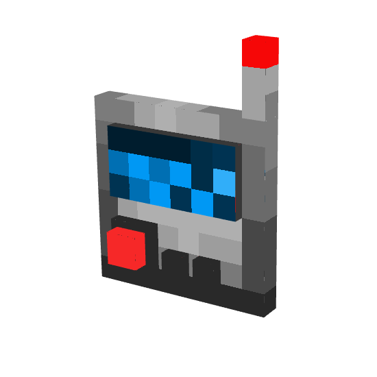

 
 

 
 

 
  

*This Minecraft Forge Mod adds a vanilla styled quarry to the game.*

*Fully fuel powered with many useful features!*

 

 
 

- Set up to 27 different blocks as filters
- Make the quarry run in loop mode for cobblestone generators
- Use the pull and eject item mode to make your build more compact and faster
- Replace broken blocks with your set block to create floors, walls or ceilings fast
- Skip air blocks to fasten up your excavation
- Select whole chunks or blocks around you with simple clicks
- Modify the selected coordinates easily in the area card gui

 

 
 

 
 

